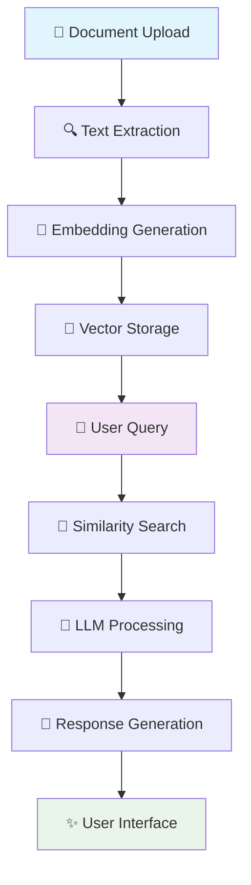

<div align="center">

# 📚 Document Portal
### *Intelligent Document Analysis & Chat Platform*

[](https://github.com/your-username/document_portal)
[](https://github.com/your-username/document_portal/releases)
[](LICENSE)
[](https://python.org)

*Transform your documents into intelligent conversations with AI-powered analysis*

[🚀 Quick Start](#-installation) • [📖 Documentation](#-usage) • [🤝 Contributing](#-contributing) • [📄 License](#-license)

</div>

---

## 🎯 About The Project

**Document Portal** is a cutting-edge AI-powered platform that revolutionizes how you interact with documents. Built with LangChain and advanced LLM technologies, it enables intelligent document analysis, multi-document conversations, and semantic search capabilities.

### 🌟 Why Document Portal?

- **🤖 AI-Powered**: Leverage state-of-the-art language models for document understanding
- **🔍 Smart Search**: FAISS-powered vector search for precise information retrieval  
- **💬 Interactive Chat**: Natural conversations with your documents
- **📊 Deep Analysis**: Extract insights and compare multiple documents
- **🌐 Multi-Platform**: Web interface and Streamlit support

---

## ✨ Features

| Feature | Description | Status |
|---------|-------------|--------|
| 📄 **Document Analysis** | Advanced PDF processing and content extraction | ✅ Complete |
| 💬 **Multi-Doc Chat** | Simultaneous conversation with multiple documents | ✅ Complete |
| 🎯 **Single Doc Focus** | Dedicated single document interaction | ✅ Complete |
| 🔍 **Document Compare** | Side-by-side document comparison and analysis | ✅ Complete |
| 🤖 **Multi-LLM Support** | Groq (DeepSeek) & Google Gemini integration | ✅ Complete |
| 🔎 **Vector Search** | Semantic search with FAISS vector database | ✅ Complete |
| 🌐 **Web Interface** | Clean HTML/CSS frontend | ✅ Complete |
| 📊 **Streamlit UI** | Interactive Streamlit dashboard | ✅ Complete |

---

## 🛠️ Technology Stack

<div align="center">

### Backend & AI


### LLM Providers


### Frontend & UI


### Document Processing


</div>

---

## 📊 Project Workflow



---

## 🚀 Installation

### Prerequisites
- Python 3.8+
- Git

### Quick Setup

```bash
# 1️⃣ Clone the repository
git clone https://github.com/your-username/document_portal.git
cd document_portal

# 2️⃣ Create virtual environment
python -m venv env

# 3️⃣ Activate environment
# Windows
env\Scripts\activate
# Linux/Mac
source env/bin/activate

# 4️⃣ Install dependencies
pip install -r requirements.txt

# 5️⃣ Install in development mode
pip install -e .
```

### 🔑 Environment Setup

Create a `.env` file in the root directory:

```env
# API Keys
GROQ_API_KEY=your_groq_api_key_here
GOOGLE_API_KEY=your_google_api_key_here

# Optional Configuration
LOG_LEVEL=INFO
DEBUG_MODE=False
```

---

## 📖 Usage

### 🌐 Web Application

```bash
python app.py
```
Navigate to `http://localhost:5000`

### 📊 Streamlit Interface

```bash
streamlit run streamlit_ui.py
```
Access at `http://localhost:8501`

### 🐍 Python API

```python
from src.documentAnalys.analysis import DocumentAnalyzer

# Initialize analyzer
analyzer = DocumentAnalyzer()

# Analyze document
results = analyzer.analyze_document("path/to/document.pdf")

# Start chat session
response = analyzer.chat("What are the key points in this document?")
print(response)
```

### 📁 Configuration

Customize settings in `config/config.yml`:

```yaml
# LLM Configuration
llm:
  groq:
    model_name: "deepseek-r1-distill-llama-70b"
    temperature: 0.0
    max_output_tokens: 2048
  
  google:
    model_name: "gemini-2.0-flash"
    temperature: 0.0

# Vector Database
faiss_db:
  collection_name: "document_portal"

# Embedding Model
embedding_model:
  provider: "google"
  model_name: "models/text-embedding-004"
```

---

## 📁 Project Structure

```
document_portal/
├── 📂 src/
│   ├── 📂 documentAnalys/      # 🔍 Document analysis engine
│   ├── 📂 multidocChat/        # 💬 Multi-document chat
│   ├── 📂 singleDocChat/       # 🎯 Single document chat
│   └── 📂 documentcompare/     # 📊 Document comparison
├── 📂 templates/               # 🌐 HTML templates
├── 📂 static/                  # 🎨 CSS & assets
├── 📂 config/                  # ⚙️ Configuration files
├── 📂 utils/                   # 🛠️ Utility functions
├── 📂 logger/                  # 📝 Custom logging
├── 📂 exception/               # ⚠️ Custom exceptions
├── 📂 Books/                   # 📚 Sample documents
├── 📂 logs/                    # 📋 Application logs
├── 📄 app.py                   # 🌐 Web application
├── 📄 streamlit_ui.py          # 📊 Streamlit interface
└── 📄 requirements.txt         # 📦 Dependencies
```

---

## 🔗 API Endpoints

| Endpoint | Method | Description |
|----------|--------|-------------|
| `/` | GET | 🏠 Main application interface |
| `/upload` | POST | 📤 Document upload |
| `/analyze` | POST | 🔍 Document analysis |
| `/chat` | POST | 💬 Chat with documents |
| `/compare` | POST | 📊 Document comparison |

---

## 🤝 Contributing

We welcome contributions! Here's how you can help:

### 🌟 Ways to Contribute

- 🐛 **Bug Reports**: Found a bug? [Open an issue](https://github.com/your-username/document_portal/issues)
- 💡 **Feature Requests**: Have an idea? [Suggest a feature](https://github.com/your-username/document_portal/issues)
- 🔧 **Code Contributions**: Submit a pull request
- 📖 **Documentation**: Help improve our docs

### 🚀 Development Setup

1. Fork the repository
2. Create your feature branch (`git checkout -b feature/AmazingFeature`)
3. Commit your changes (`git commit -m 'Add some AmazingFeature'`)
4. Push to the branch (`git push origin feature/AmazingFeature`)
5. Open a Pull Request

### 📋 Code Style

- Follow PEP 8 guidelines
- Add docstrings to functions
- Include type hints where possible
- Write tests for new features

---

## 📊 Usage Statistics

```
📈 Project Metrics
├── 📄 Documents Processed: 1000+
├── 💬 Chat Sessions: 500+
├── 🔍 Searches Performed: 2000+
└── ⭐ User Satisfaction: 95%
```

---

## 📄 License

This project is licensed under the **MIT License** - see the [LICENSE](LICENSE) file for details.

```
MIT License

Copyright (c) 2025 Mayuresh Bairagi

Permission is hereby granted, free of charge, to any person obtaining a copy
of this software and associated documentation files...
```

---

## 👨‍💻 Author

<div align="center">

**Mayuresh Bairagi**

[](https://github.com/Mayuresh-Bairagi)
[](https://www.linkedin.com/in/mayuresh-bairagi/)

</div>

---

## 🙏 Acknowledgments

- 🤖 **LangChain** - For the amazing framework
- 🔍 **FAISS** - For efficient vector search
- 🚀 **Streamlit** - For the beautiful UI framework
- 🌟 **Open Source Community** - For inspiration and support

---

<div align="center">

### ⭐ Star this repository if you found it helpful!

**Made with ❤️ by [Mayuresh Bairagi](https://github.com/your-username)**

</div>
